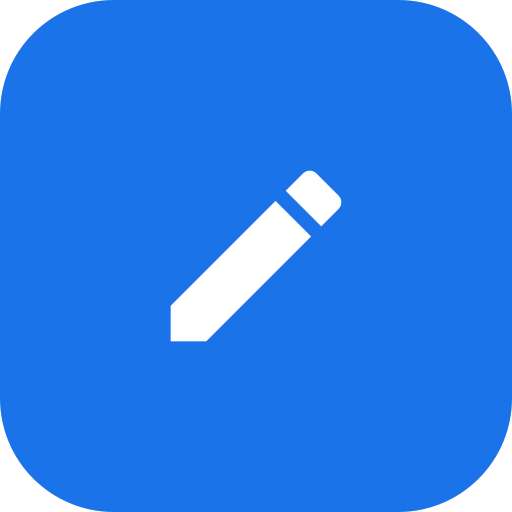
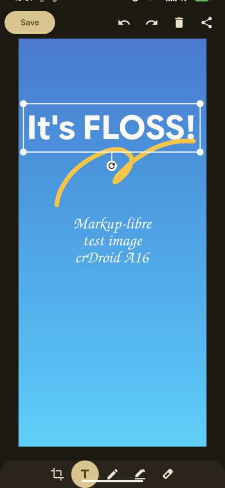

<p align="center">
  
</p>

# Marklibre

An open-source, dependency-free reimplementation of **Google Markup**
(`org.librelab.marklibre`), the screenshot annotation editor shipped on
Pixel / GMS devices. Built from scratch in Kotlin — no Google proprietary
code, no closed-source SDKs, no native Ink/Sketchology engine. The entire
ink engine is a hand-drawn Canvas implementation.

> **Disclaimer:** This is an independent, clean-room-style reimplementation
> based on the *observable behavior* of the original app. It is not affiliated
> with or endorsed by Google. "Markup" and "Google" are trademarks of their
> respective owners.

## Screenshot



*Editing a screenshot on a Redmi K40 (alioth), pen tool active.*

## Features

- **Pen** — 7 ink colors, round-cap stroke with quadratic smoothing, width
  slider (2-16 dp) with a live preview bar
- **Palette** — a custom-color button opens a color picker (hue /
  saturation / brightness / opacity sliders + hex field); custom colors
  carry their own opacity
- **Two-finger zoom / pan** — while a brush tool is active, pinch to zoom
  and drag with two fingers to pan the whole image (ink included); a single
  finger still draws
- **Highlighter** — translucent thick stroke over the image
- **Eraser** — removes ink only, never damages the underlying image
- **Text tool** — 6 font styles (Bold / Classic / Modern / Script / Soft /
  Bubbly), 7 colors; tap to select, tap again to edit, drag to move, corner
  handles to scale (anchored on the opposite corner), rotation knob to rotate
- **Crop** — draggable rectangle with 8 handles
- **Rotate** — one tap rotates the whole image (ink included) 90° clockwise
- **Undo / Redo** — full history for strokes, text edits and crops
- **Save / Share / Copy / Delete** — full-resolution PNG export via FileProvider
- **Sticker editor** — draw on a transparent canvas, save as a sticker PNG
  (mirrors the original `StickerActivity` flow)
- **Drop-in for custom ROMs** — mirrors the original's versionCode and
  `ACTION_EDIT image/*` entry point, so SystemUI screenshot
  "edit" integration works out of the box

## Tech stack

| Component | Version |
|---|---|
| Kotlin | 2.4.0 |
| Gradle | 9.6.0 (wrapper) |
| Android Gradle Plugin | 9.3.1 |
| compileSdk / targetSdk | 36 |
| minSdk | 35 (Android 15) |

## Build

```bash
./gradlew :app:assembleDebug
# APK: app/build/outputs/apk/debug/app-debug.apk
```

Requires JDK 17+ and Android SDK Platform 36.

## Install

```bash
adb install -r app/build/outputs/apk/debug/app-debug.apk
```

Or integrate into a ROM build as a system app (it uses the same package name
and signature-level permission model as the original).

## Project structure

```
app/src/main/java/org/librelab/marklibre/
├── AnnotateActivity.kt      # main editor (ACTION_EDIT image/*)
├── DrawingCanvasView.kt     # ink engine: strokes, text, undo/redo, export
├── InkModel.kt              # element / operation model
├── ToolbarFragment.kt       # crop / text / pen / highlighter / eraser
├── ColorButton.kt           # ink color swatch
├── PenButton.kt             # tinted pen/highlighter tool button
├── CropOverlayView.kt       # crop handles + dimming overlay
├── text/                    # text editor (fonts, colors)
└── sticker/                 # sticker editor
```

## License

[GPLv3](LICENSE) — free software, use it, modify it, ship it in your ROM.
